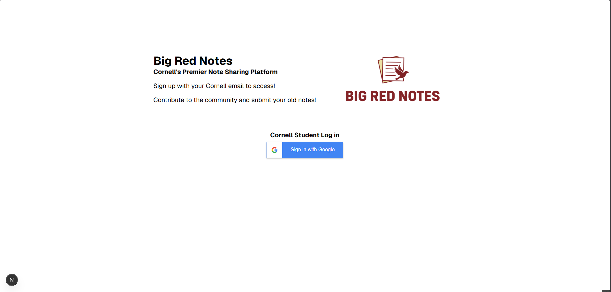
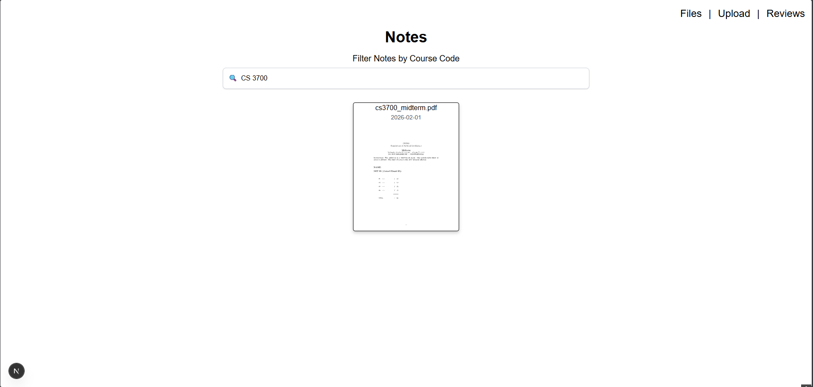
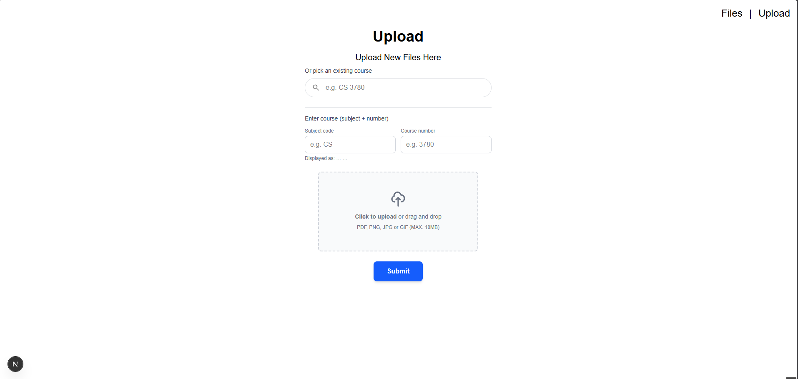

# BigRedNotes

## Description

BigRedNotes is a course notes sharing app for Cornell. Users sign in with Google, upload notes (PDFs and images) tied to a course (e.g. CS 3410, PSYCH 1101), and browse or download notes by course. The file cards show the first page thumbnail of the PDF and you can click on it to fully access the file. The app is read-only for browsing—upload and files pages are protected and require sign-in.

## Tech Stack

| Layer        | Technology |
| ------------ | ---------- |
| Framework    | [Next.js](https://nextjs.org) 16 (App Router) |
| UI           | [React](https://react.dev) 19, [Tailwind CSS](https://tailwindcss.com) 4 |
| Language     | [TypeScript](https://www.typescriptlang.org) 5 |
| Database     | [PostgreSQL](https://www.postgresql.org) with [Prisma](https://www.prisma.io) 6 |
| Auth         | [NextAuth.js](https://nextauth.js.org) 5 (Google OAuth) |
| File storage | Local disk or [AWS S3](https://aws.amazon.com/s3/) (SDK v3, presigned URLs for private buckets) |
| PDF preview  | [pdfjs-dist](https://github.com/mozilla/pdf.js) (Mozilla PDF.js) for first-page thumbnails |

## Screenshots

**Home** — Landing and sign-in.

**Notes** — Filter and view uploaded notes by course; image/PDF thumbnails and download links.

**Upload** — Pick a course (subject + number) and upload a file (PDF or image).

## Getting Started

1. Install dependencies: `npm install`
2. Copy `.env.example` to `.env.local` and set `DATABASE_URL`, and optionally AWS vars for S3.
3. Run migrations: `npx prisma migrate dev`
4. (Optional) Seed courses: `npx prisma db seed`
5. Run the dev server: `npm run dev` — open [http://localhost:3000](http://localhost:3000)
